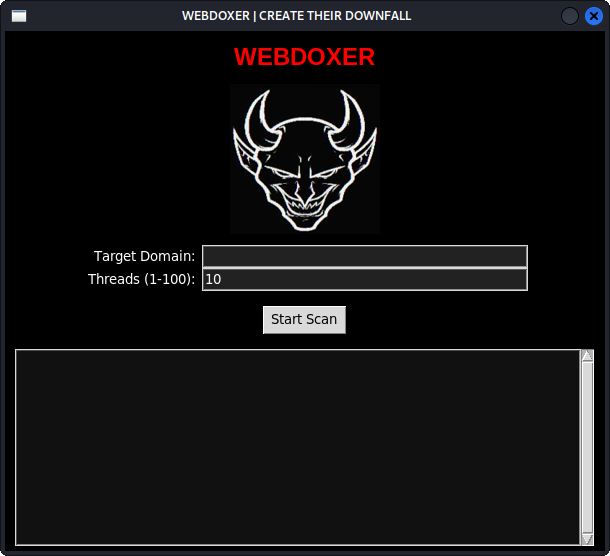
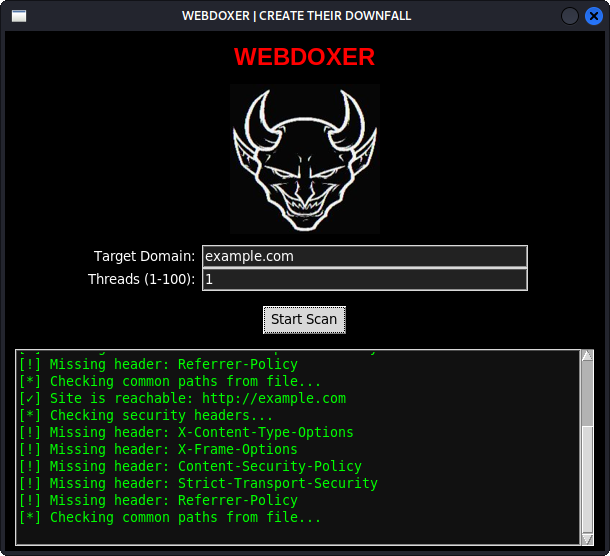
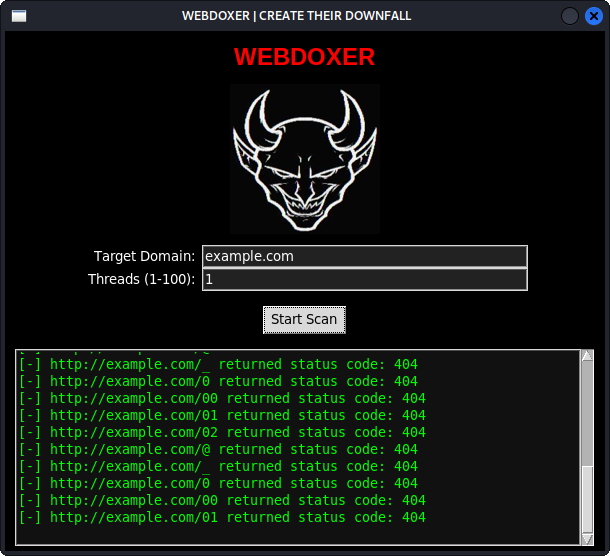

# Webdoxer

Webdoxer is a lightweight, ethical web vulnerability testing tool built for educational and penetration testing purposes. It automates basic XSS, SQL Injection, and hidden path discovery tests using customizable payload lists.

This tool is intended for authorized use only. Do not use it on websites you do not own or do not have explicit permission to test.

---

## Screenshot






---

## Features

- Automated testing for:
  - vulnerability scanning for missing securities
  - Cross-Site Scripting (XSS)
  - SQL Injection (SQLi)
  - Hidden and common paths (e.g., `/admin`, `/backup`, etc.)
- Custom payload files (`.txt`) included
- CLI-based interface for lightweight use
- Installable globally via pip

---

## Installation

```bash
git clone https://github.com/VulnVex/webdoxer.git
cd webdoxer
pip install -r requirements.txt
pip install . --break-system-packages
webdoxer
